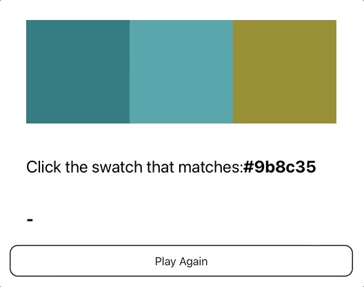

# Color Challenge

I found this challenge on Client.dev they provide interview type questions for front end developers. 

## Challenge

Your goal is to display three random color swatches as 100px by 100px squares. Below you will show the hext color of one of these swatches. When a swatch is clicked display a message "correct" if the color of the swatch matches the hex color displayed, or incorrect if it does not match. 

You can't see the cursor in this gif. Imagine that I'm clicking one of the color switches then the text "correct" or "icorrect is displayed. 

## Discussion 

- How do you ghenerate a hex color? 
- How to apply the color to a component? 
- How much state do you need? 
