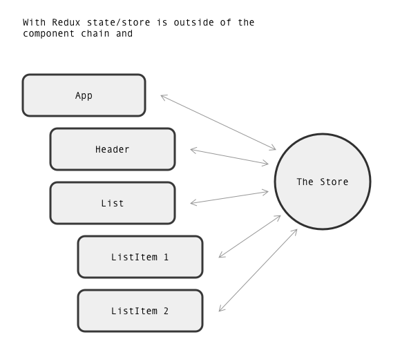
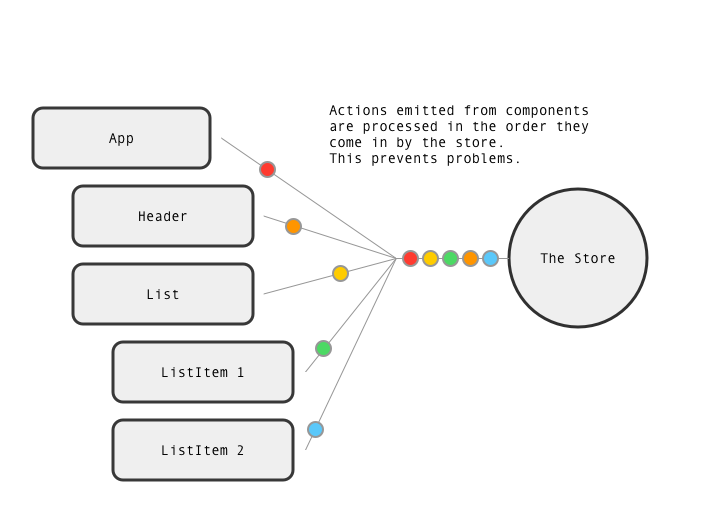

# FEW 2.3 - Lesson 9

# Redux Toolkit

Redux Toolkit is the officially endorsed Redux integration for create-react-app projects. They describe themselves as: 

> The official, opinionated, batteries-included toolset for efficient Redux development

Check out the website: https://redux-toolkit.js.org

<!-- > -->

## Review: Redux

<!-- > -->

What do you remember about the first discussion of redux? 

<!-- > -->

What is an action? 

<!-- > -->

What is a reducer?

<!-- > -->

What is the store?

<!-- > -->

Review the Redux concepts: 

The Store:



Actions:



Key concepts: 

- The store lives outside your component tree
- Components get values from the store directly
- To change state a component sends an action

## Redux 

Redux is an application state management library. They describe as: 

> A Predictable State Container for JS Apps

Check out their website: https://redux.js.org

To use redux you need to create a store object. To create the store you need to define some reducers. A reducer is used to manage a "piece" of the application state. A piece of state is a value that you are storing in the store. Each "piece" of state will have a reducer that is responsible for updating that "piece."

Imagine you were creating a todo app and the application state was an array of todo objects. You might define "todosRedcuer" as handled adding, removing, and updating todo items in the array. 

Changes to state are made by sending actions. An action has a type and a payload. In the todos example, you might send a "createTodo" action, with a payload that is the name of the thing you want to that appears on the list like: "do laundry."

- Redux has a store where all of the state is stored
- Reducers handle changes to state
- Actons are sent to the store when you want to make a change
- A payload is included with an action it has the data needed to make the change

## React-Redux 

React Redux is a library that acts as the glue or conduit that connects React and Redux. 

React Redux gives us a Provider component and some react hooks. The provider component and hooks are what allow your components to communicate with the store. 

You will always wrap your top-level component, usually App, in the `<Provider>` component. The provider takes the store as a prop. Something like this: 

```JS
<Provider store={store}>
  <App />
</Provider>
```

The code above came from `index.js` in my React project. 

## React Toolkit

React Toolkit provides utilities and a framework to use Redux in React projects. It's here that you will define the reducers and actions that we talked about above! 

Redux Toolkit divides state into "slices." Think of a slice of the initial value for a piece of state, the action, and the reducer to manage that piece. 

You would start defining a slice with `createSlice`. 

Start with `createSlice`. Look for this code in the tutorial projects. They all implement Redux Toolkit! Every slice needs a name. You create a slice with the `createSlice` function and supply an object to configure it. 

```JS
import { createSlice } from '@reduxjs/toolkit'

export const todosSlice = createSlice({
  name: 'todos'
})
```

Every slice needs an initial value. Imagine the todos app. If todos are stored in an array. The initial value for this slice might be an empty array. 

```JS
import { createSlice } from '@reduxjs/toolkit'

const initialState = {
  value: []
}

export const todosSlice = createSlice({
  name: 'todos', 
  initialState, 
})
```

A slice needs to define some reducers. 

```JS
import { createSlice } from '@reduxjs/toolkit'

const initialState = {
  value: []
}

export const todosSlice = createSlice({
  name: 'todos', 
  initialState, 
  reducers: {

  }
})
```

Notice how a reducer is an object. Each of the properties/keys on the reducers object will be functions that handle changes to state. 

```JS
import { createSlice } from '@reduxjs/toolkit'

const initialState = {
 value: []
}

export const todosSlice = createSlice({
  name: 'todos', 
  initialState, 
  reducers: {
    addTodo: (state, action) => {
      state.value.push( { doWhat: action.payload, completed: false, date: new Date() } ) 
    },
  }
})
```

Here I added `addTodo` action. The function takes two parameters: `state` and `action`. `state` is the array from `initialState` and an action is an object with a `payload` property. Imagine the payload is the name of a new todo item that needs to be added to the todos array, something like "wash the dog." I added a couple of extra items to the todo object to make a realistic example. The object pushed into `state.value` would be a new todo item in our array. 

The function `(state, action) => { state.value.push(...)}` is the reducer, and `addTodo` is the action! 

The last step is to export the actions and reducer, like this: 

```JS
import { createSlice } from '@reduxjs/toolkit'

const initialState = {
  value: []
}

export const todosSlice = createSlice({
  name: 'todos', 
  initialState, 
  reducers: {
    addTodo: (state, action) => {
      state.value.push( { doWhat: action.payload, completed: false, date: new Date() } ) 
    },
  }
})

export const { addTodo } = timersSlice.actions
export default todosSlice.reducer
```

Notice how you export the action and the reducer. 

What if you need to remove a todo from the array? You need to define a new action and a new reducer. To remove an item from an array we need to know its index. In this case, the index might be the payload. 

```JS
export const todosSlice = createSlice({
  name: 'todos', 
  initialState, 
  reducers: {
    addTodo: (state, action) => {
      state.value.push( { doWhat: action.payload, completed: false, date: new Date() } ) 
    },
    removeTodo: (state, action) => {
      state.value.splice(acton.payload, 1) // removes 1 item at index payload
    }
  }
})
```

Here is a new action `removeTodo` with a new reducer. The reducer always takes `state` and `action` as parameters. Every reducer you define will take these two parameters! 

The last step is to export the action

```JS
export const { addTodo, removeTodo } = timersSlice.actions
```

## React Redux Hooks

I mentioned React Redux supplied some hooks. The two most common hooks you will use are: `useSelector` and `useDispatch`

**useSelector**

Imagine you wanted to display the list of todos in a component. 

```JS
import { useSelector } from 'react-redux'
import TodoView from './TodoView'

export default function ListTodos() {
  const todos = useSelector(state => state.todos.value)
  
  return // display some todo items here...
}
```

`useSelector` takes a call back that receives your redux state. Since we want the todos we get them with `state.todos.value`. Compare this to the `initialState` that was defined in the example above. Since `todos` is an array you could map it to components. 

**useDispatch**

Imagine you want to create a new todo. For this, you need to send an action to the dispatcher. Import the action and the `useSelector` hook. 

```JS
import { useDispatch } from 'react-redux'
import { addTodo } from '../features/timers/todosSlice'

export default function NewTodo() {
  const [ name, setName ] = useState('')
  const dispatch = useDispatch()

  return (
    <div>
      <input
        value={name}
        onChange={(e) => setName(e.target.value)}/>
      <button
        onClick={() => dispatch(addTodo( name ))}
      >Save</button>
    </div>
  )
}
```

First I imported `useDipatch` and `addTodo`. I need `useDispatch` to "dispatch" actions and I need the action I exported from the slice above. 

Here I used the React controlled component pattern to enter a "name" in an input. I used the state variable `name` to hold the name. 

In the component, I called `useDispatch` and it returns a function that is used to dispatch actions. 

Dispatch an action by calling the action and providing the payload as the argument. This returns the action object. Call the `dispatch` function and provide the action object as an argument. You could break this down like this: 

```JS
<button
  onClick={() => {
    const action = addTodo( name ) // name is the payload
    dispatch( action ) // call dispatch with an action
  }}
>Save</button>
```

## Review

- Redux is an application state management library
- Redux Toolkit is the official library to integrate redux with react
- Redux Toolkit divides state into slices
- A slice is made up of
  - initial state 
  - actions
  - and reducers
- Actions are "messages" that you send to make changes to state
- Reducers are where changes to state occur
- React Redux provides components and hooks that work with redux
- The `Provider` component makes the hooks work
- `useSelector` gives your component access to redux state
- `useDispatch` allows your components to send actions

## After Class

The goal for today is to have a React Project with Redux. It doesn't have to be fully functional and may need changes, but it should have redux installed and functional. 

- Install Redux
- Add Actions
- Add Reducers
- Combine Reducers
- Create Store

Submit your work to grade scope. 

## Additional Resources

- https://redux.js.org
- https://redux-toolkit.js.org

